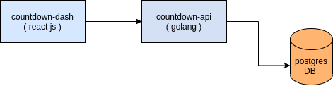

# THIS APPLICATION IS NO LONGER ACTIVELY MAINTAINED ( Visit : https://countd.xyz/ )

# countdown 

* Countdown is an application that allows you to visualize your tasks with a live countdown next to it. 

### [countdown-dash](countdown-dash/README.md)

* ReactJS app to visualize all the tasks and their countdowns 

### [countdown-api](countdown-api/README.md)

* HTTP server written in Go for creating, deleting and listing tasks 

### Architecture 

### Getting started 

* Prerequisites
    - docker and docker-compose 

* Prerequisites for dev
    - docker and docker-compose 
    - nodejs and npm 
    - Go 1.13+ 

* To startup the whole application run 
    - `docker-compose up` 

---

if you run into any issues with getting the app started please feel free to create an issue. :) 
