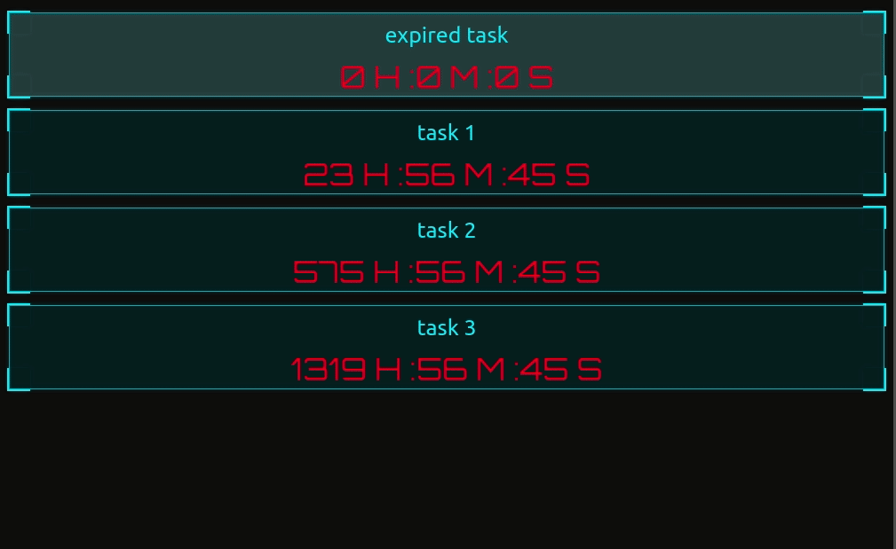

## countdown-dash 

UI for displaying the tasks and their countdowns 

* The tasks will be sorted by the timestamp.
* If a task is expired, the card that contains the task wish flash

-----
#### development setup 
----
* Have npm and nodejs installed 
* go into the countdown-dash directory
* run `npm start` 
